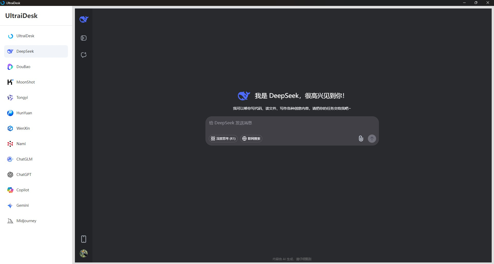

# UltraiDesk

---

A lightweight desktop software that aggregates the pages of general large language models from various companies.

### Features

Light and handy
UltraiDesk integrates more than a dozen general large language models. You can enjoy a smooth experience when switching between conversations with different intelligent agents, ensuring that inspiration never slips away. It is at your service!

### Data security

UltraiDesk is open - source software, ensuring complete transparency. The conversation data between you and the intelligent agents is all securely stored in your account. Rest assured, UltraiDesk has no right to access your privacy and data!

### Cross-Platform

Available for Windows, macOS, and Linux.